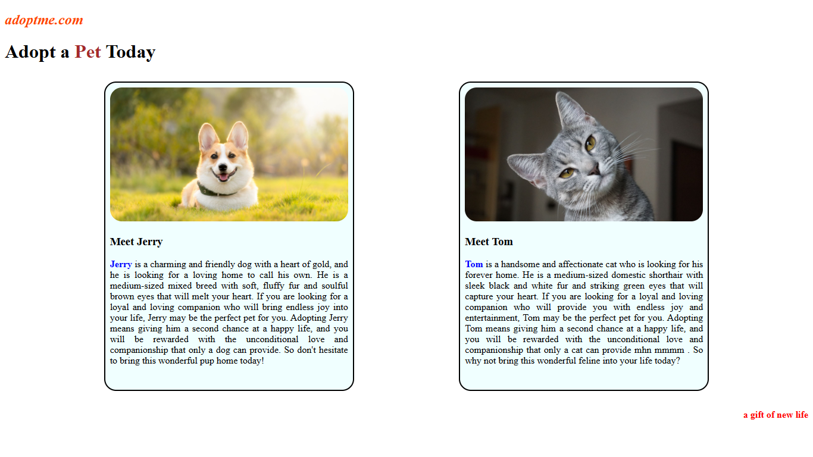

# 🐾 Pet Adoption Page  

A simple and responsive **Pet Adoption Website** built with **HTML & CSS**.  
This project showcases pets available for adoption using clean card layouts, images, and descriptive text.  

---

## 🌟 Features  
- 🐶 Pet profiles with images and details  
- 🎨 Styled with CSS (cards, colors, hover effects)  
- 📱 Responsive design with media queries  
- 💡 Beginner-friendly project for practicing HTML & CSS  

---

## 🚀 Demo  
  
*(Replace with your actual screenshot if available)*  

---

## 🛠️ Technologies Used  
- **HTML5**  
- **CSS3**  

---

## 📂 Project Structure  
